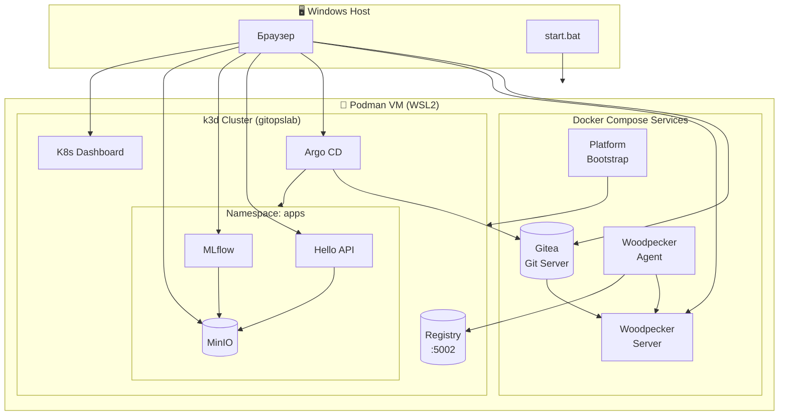
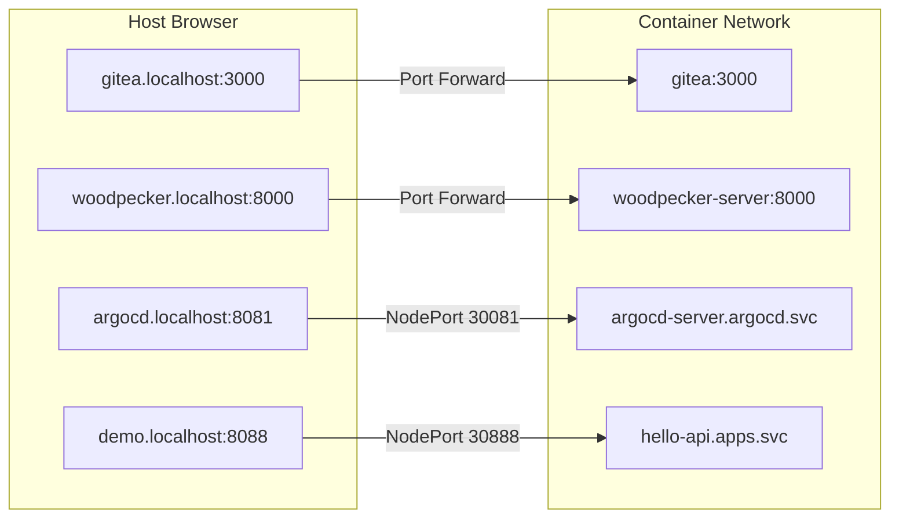
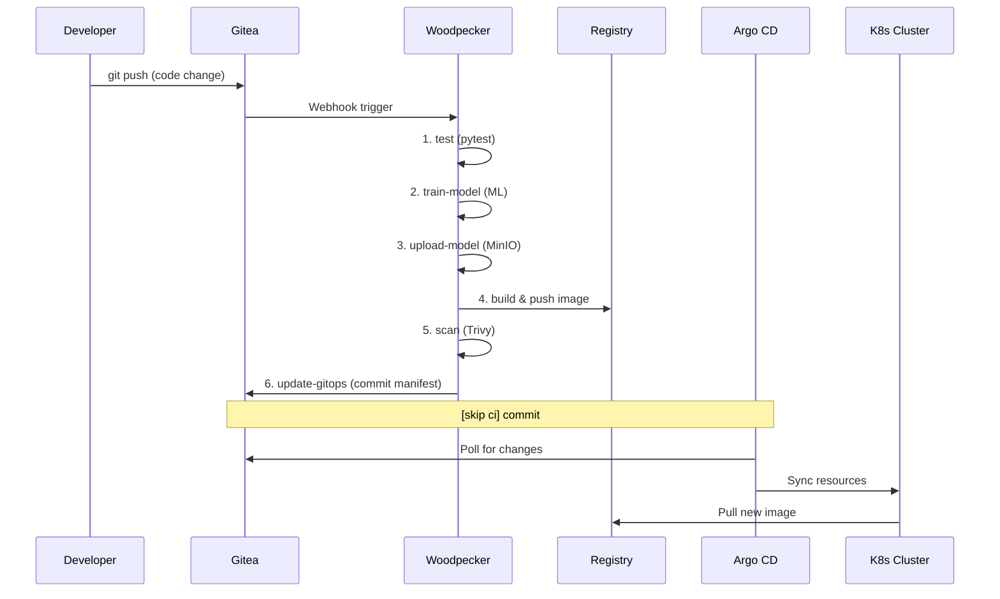
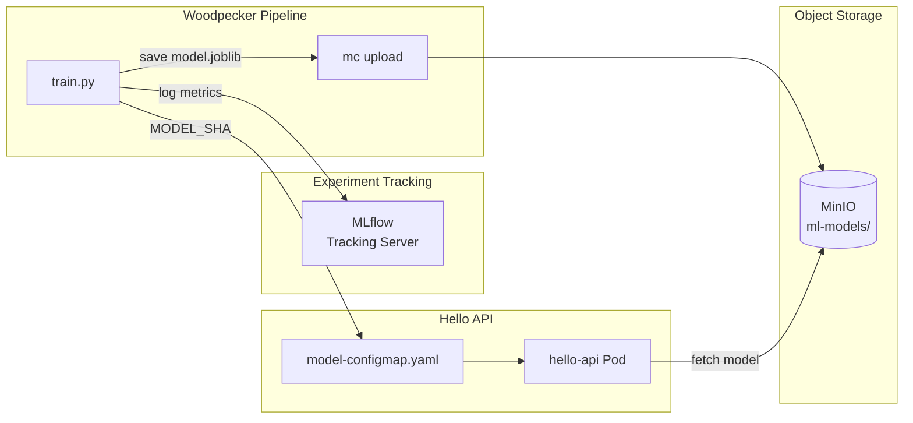

# Архитектура GitOpsLab

Полное описание архитектуры платформы, взаимодействия компонентов и потока данных.

---

## 🏗️ Обзор Системы

GitOpsLab — это демонстрационная платформа "IDP-in-a-Box", объединяющая **GitOps** и **MLOps** практики в единую автоматизированную среду.



---

## 🧱 Компоненты Системы

### GitOps Layer (CI/CD)

| Компонент | Роль | Порт |
|-----------|------|------|
| **Gitea** | Git-сервер, хранит код и GitOps-манифесты | `3000` |
| **Woodpecker Server** | CI-сервер, управляет pipelines | `8000` |
| **Woodpecker Agent** | Выполняет jobs pipeline | — |
| **Argo CD** | GitOps-контроллер, синхронизирует K8s с Git | `8081` |
| **Registry (k3d)** | Container registry для образов | `5002` |

### MLOps Layer

| Компонент | Роль | Порт |
|-----------|------|------|
| **MLflow** | Tracking экспериментов и моделей | `8090` |
| **MinIO** | Object storage для артефактов ML | `9090/9091` |

### Platform Layer

| Компонент | Роль | Порт |
|-----------|------|------|
| **k3d** | Легковесный K3s кластер в контейнерах | `6550` (API) |
| **K8s Dashboard** | Веб-интерфейс управления кластером | `32443` |
| **Bootstrap** | Одноразовый контейнер инициализации | — |

---

## 🌐 Сетевая Топология

### Split-Horizon DNS

Система использует **split-horizon DNS** для разрешения имён:



### Маппинг Портов

| Host URL | Внутренний адрес | NodePort |
|----------|-----------------|----------|
| `gitea.localhost:3000` | `gitea:3000` | — |
| `woodpecker.localhost:8000` | `woodpecker-server:8000` | — |
| `argocd.localhost:8081` | `argocd-server:443` | `30081` |
| `demo.localhost:8088` | `hello-api:8080` | `30888` |
| `mlflow.localhost:8090` | `mlflow:5000` | `30902` |
| `minio.localhost:9090` | `minio:9000` | `30900` |
| `minio.localhost:9091` | `minio:9001` | `30901` |
| `dashboard.localhost:32443` | `dashboard:443` | `32443` |
| `registry.localhost:5002` | `k3d-registry:5000` | — |

### Сети

| Сеть | Назначение |
|------|-----------|
| `gitopslab` | Основная сеть для Podman-контейнеров |
| `k3d` | Сеть k3d кластера (внутренняя) |

---

## 🔄 Delivery Flow (CI/CD Pipeline)



### Этапы Pipeline

1. **test** — Запуск pytest для Hello API
2. **train-model** — Обучение ML-модели, логирование в MLflow
3. **upload-model** — Загрузка модели в MinIO
4. **build** — Сборка Docker-образа
5. **scan** — Сканирование уязвимостей (Trivy)
6. **update-gitops** — Обновление K8s-манифестов в Git

---

## 🤖 ML Flow (Model Training)



### Артефакты ML

| Артефакт | Хранилище | Путь |
|----------|-----------|------|
| `model.joblib` | MinIO | `ml-models/iris-{commit}.joblib` |
| `MODEL_OBJECT` | ConfigMap | `gitops/apps/hello/model-configmap.yaml` |
| `MODEL_SHA` | ConfigMap | SHA256 хеш модели |
| Метрики | MLflow | `hello-api-training` experiment |

---

## 📁 Структура GitOps Репозитория

```
gitops/
├── argocd/
│   └── root-app.yaml          # Root Application (App of Apps)
└── apps/
    ├── hello-application.yaml  # ArgoCD Application для Hello API
    ├── hello/
    │   ├── deployment.yaml     # 👈 Обновляется pipeline
    │   ├── service.yaml
    │   ├── ingress.yaml
    │   └── model-configmap.yaml # 👈 Обновляется pipeline
    ├── mlflow-application.yaml
    ├── mlflow/
    │   └── ...
    ├── minio-application.yaml
    ├── minio/
    │   └── ...
    ├── dashboard-application.yaml
    └── dashboard/
        └── ...
```

---

## 🔗 Связанная Документация

- [SCRIPTS.md](SCRIPTS.md) — Справочник всех скриптов
- [CONFIGURATION.md](CONFIGURATION.md) — Гид по конфигурации
- [INSTALLATION.md](INSTALLATION.md) — Инструкции по установке
- [LIFECYCLE.md](LIFECYCLE.md) — Управление жизненным циклом
- [HEALTH_CHECKS.md](HEALTH_CHECKS.md) — Система проверок здоровья
